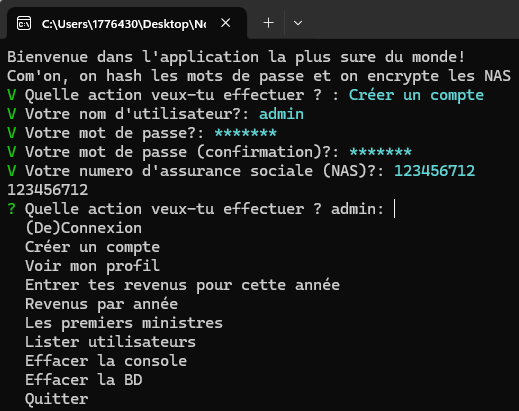
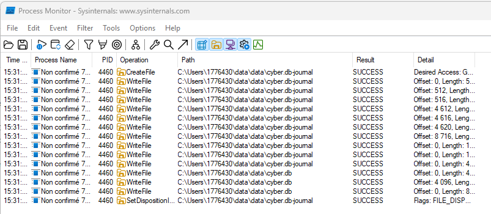
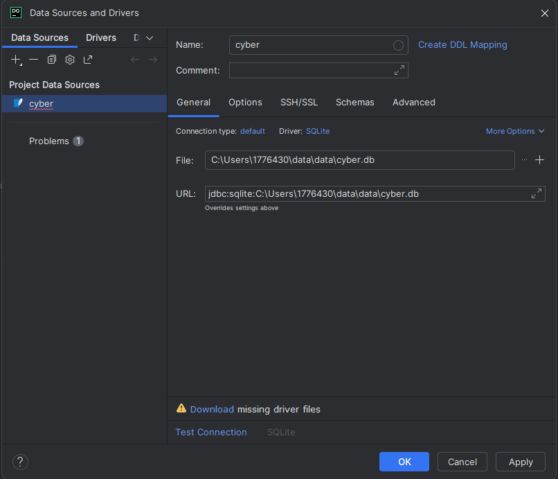

# Rapport TP3 de Cybersec Maika Veilleux

## Attaque 1: BD fuitée et mot de passe

1. Déterminer où le .exe stocke la BD locale :  
   a) Démarrer l'outil Process Monitor puis lancer l'application et effectuer une action qui effectue une modification (ex. : créer un utilisateur). Une fois l'action terminée, arrêtez la capture en cliquant sur le bouton "Capture"  
     
   b) Entrer des filtres pour obtenir une opération d'écriture provenant de notre exécutable et localiser l'emplacement de la BD. Dans notre cas, la BD se situe dans le répertoire /  
     
2. Ouvrir le fichier de la BD trouvé plus haut avec l'application DataGrip :  
     
4. Dans l'application, créer de nouveaux comptes utilisateurs et utiliser l'option "Les premiers ministres".  
     
5. Rafraichir la table MUtilisateur et constater que nous avons accès aux mots de passes des comptes créés et de tous les premiers ministres.

### Correctif implanté

Description du correctif.

Preuve que l'attaque ne fonctionne plus avec étapes + copie d'écran

## Attaque 2: BD fuitée et encryption

1. Etape 1 + copie d'écran
2. Etape 2 + copie d'écran
3. etc.

### Correctif implanté

Court descriptif du correctif et lien vers le(s) commit(s).

Preuve que l'attaque ne fonctionne plus avec étapes + copie d'écran

## Attaque 3 Injection SQL

1. Etape 1 + copie d'écran
2. Etape 2 + copie d'écran
3. etc.

### Correctif implanté

Description du correctif.

Preuve que l'attaque ne fonctionne plus avec étapes + copie d'écran
