# Rapport TP3 de Cybersec Maika Veilleux

## Attaque 1: BD fuitée et mot de passe

1. Déterminer où le .exe stocke la BD locale :  
   a) Démarrer l'outil Process Monitor puis lancer l'application et effectuer une action qui effectue une modification (ex. : créer un utilisateur). Une fois l'action terminée, arrêtez la capture en cliquant sur le bouton "Capture".  
     
   b) Entrer des filtres pour obtenir une opération d'écriture provenant de notre exécutable et localiser l'emplacement de la BD. Dans notre cas, la BD se situe dans le répertoire C:\Users\1776430\data\data\.  
     
2. Ouvrir le fichier de la BD trouvé plus haut avec l'application DataGrip :  
     
3. Dans l'application, créer de nouveaux comptes utilisateurs et utiliser l'option "Les premiers ministres".  
     
4. Rafraichir la table MUtilisateur et constater que nous avons accès aux mots de passes hachés des comptes créés et de tous les premiers ministres.
   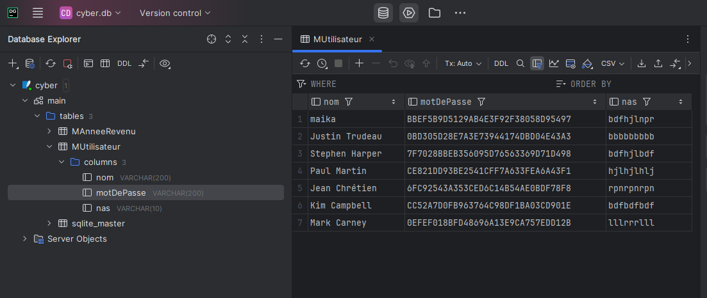  
5. 5 des 7 mots de passes ont pu être craqués à l'aide de CrackStation.
   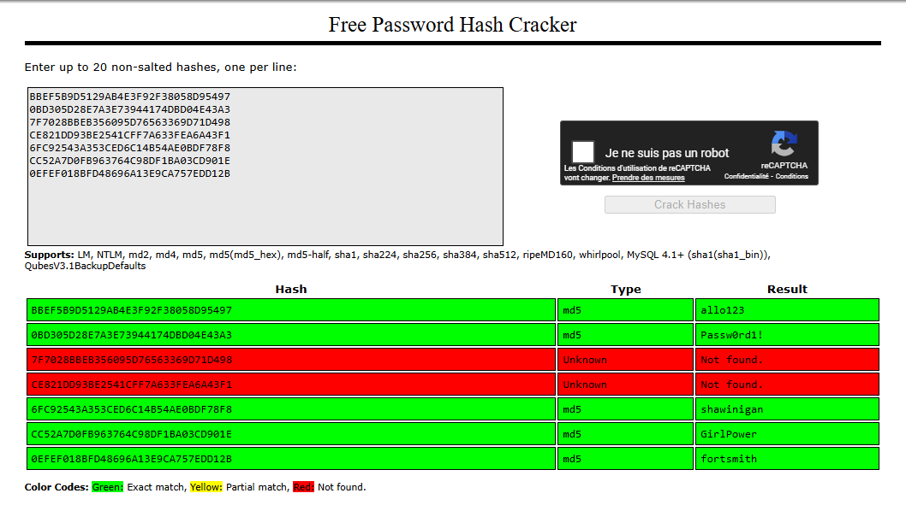  

### Correctif implanté

Implanter Bcrypt dans le code source de l'application et changer les fonctions "HacherLeMotDePasse" et "VerifierLeMotDePasse" pour utiliser la librairie qui implante Bcrypt.  
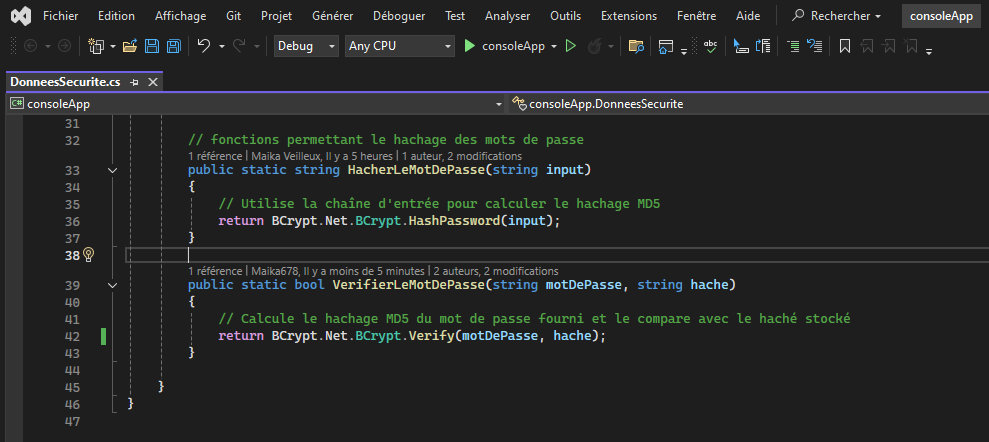  

Preuve que l'attaque ne fonctionne plus :
1. créer un utilisateur et utiliser l'option "Les premiers ministres".   
   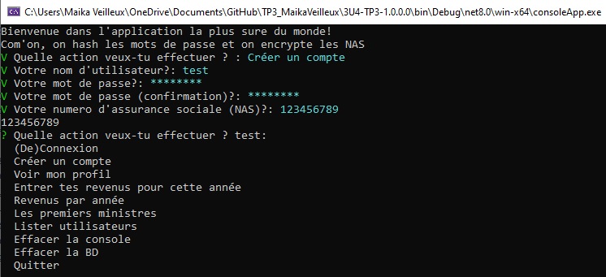  
2. Rafraichir la table MUtilisateur et tenter de craquer le mot de passe des ministres et du nouvel utilisateur à l'aide de CrackStation.  
   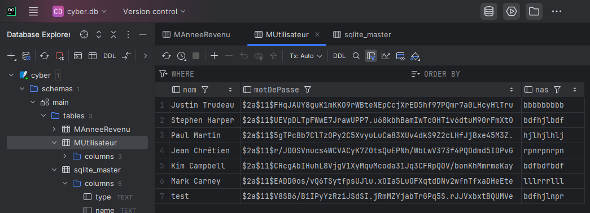  
   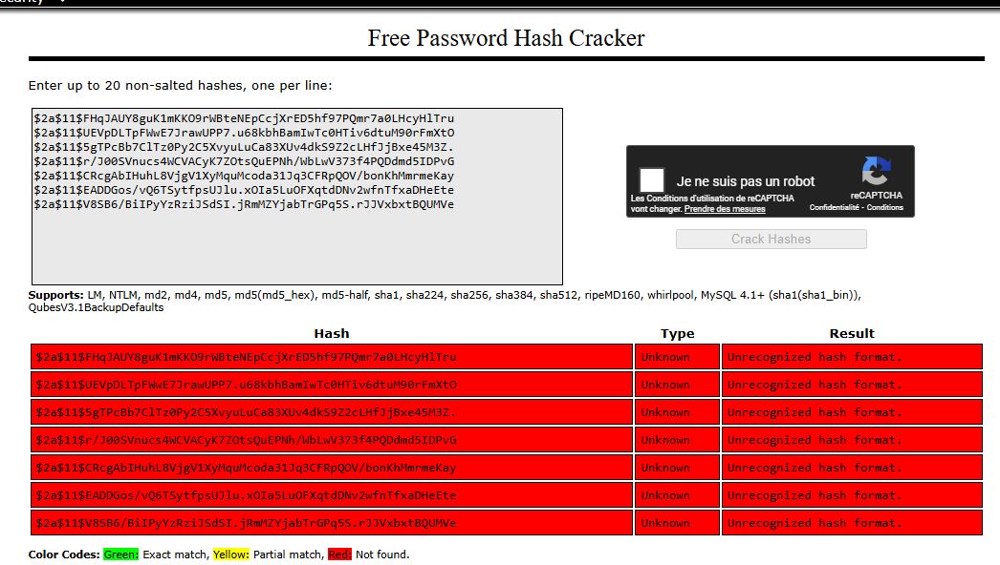  
Les mots de passes n'ont pas pu être craqués.
   

## Attaque 2: BD fuitée et encryption

1. Dans l'application, créer un utilisateur avec le NAS 123456789.  
   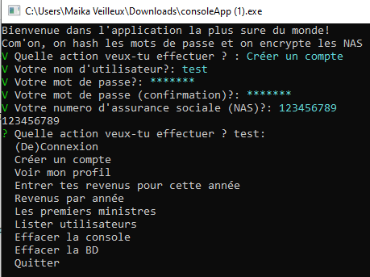  
2. Rafraichir la table MUtilisateur pour construire la table de traduction. Dans notre cas : 123456789 = bdfhjlnpr. Donc, 1=b, 2=d et ainsi de suite.  
   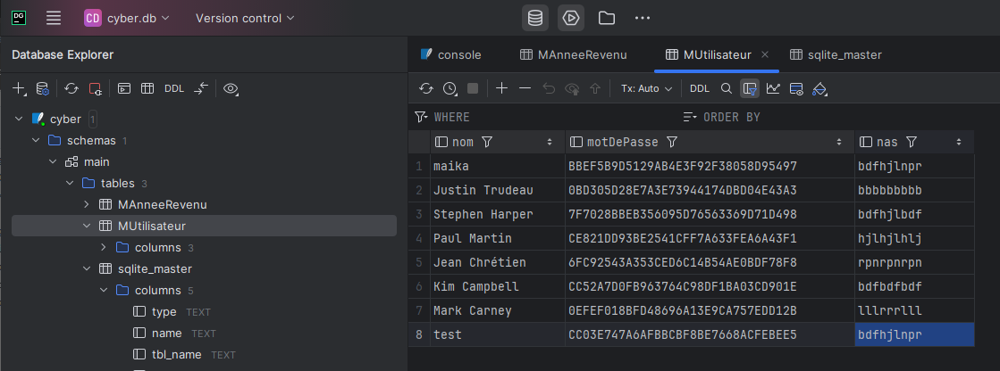  
3. Utiliser l'IA pour traduire tout les autres NAS chiffrés.  
   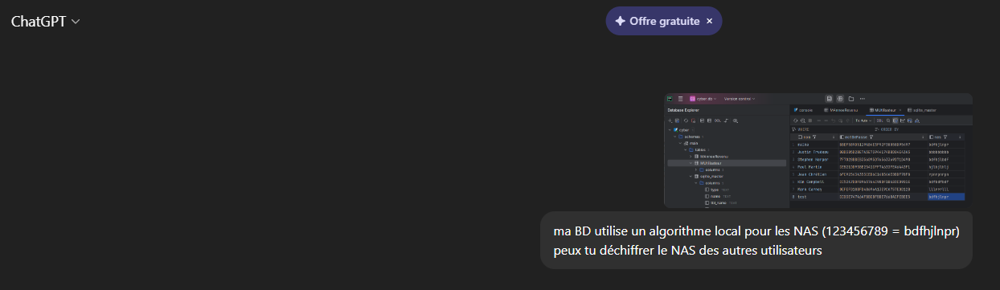  
   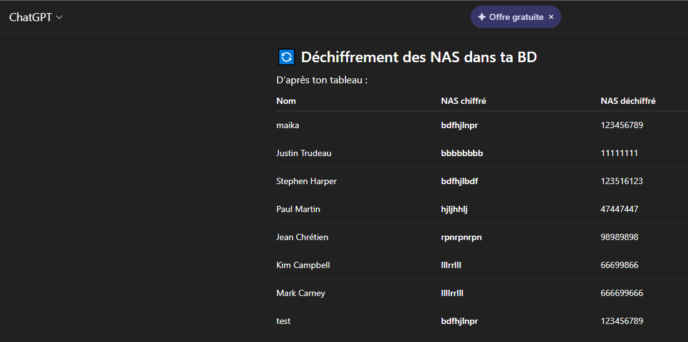  

### Correctif implanté

implanter un algorythme d'encryption dans l'application et modifier les fonctions "Encrypter" et "Decrypter" pour utiliser cet algorythme. 
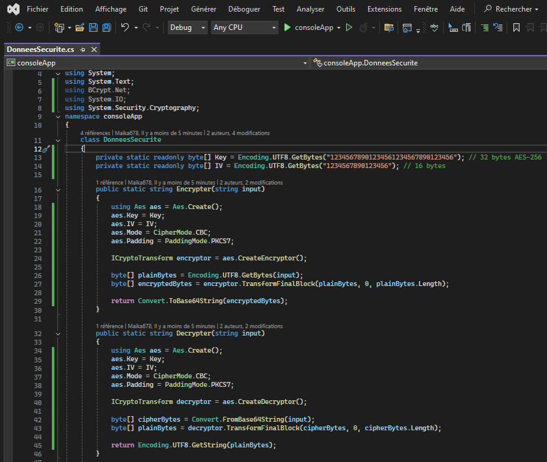  

Preuve que l'attaque ne fonctionne plus :  
1. Dans l'application, utiliser l'option "Les premiers ministres" et créer un utilisateur avec le NAS 123456789.
   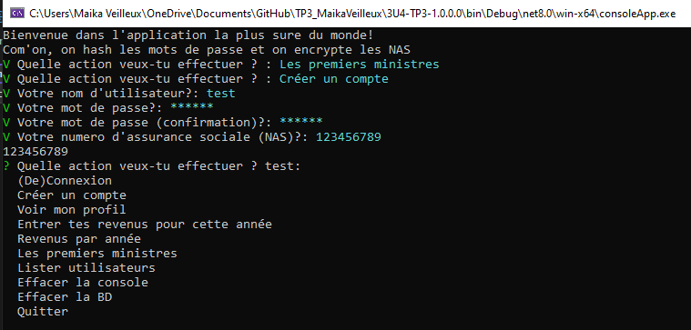  
2. Rafraichir la table MUtilisateur.
   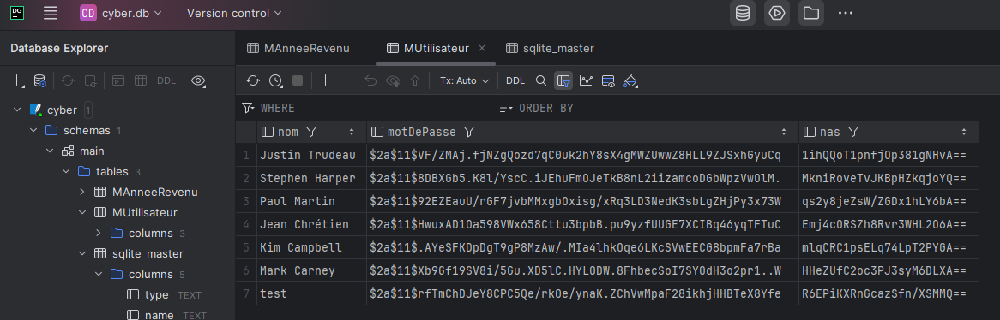  
Il est maintenant impossible de créer une table de traduction. Sans la clé, l'attaquant n'est pas en mesure de décrypter les NAS.

## Attaque 3 Injection SQL

1. Dans l'application, créer un utilisateur test et utiliser l'option "Les premiers ministres" pour avoir des données.
   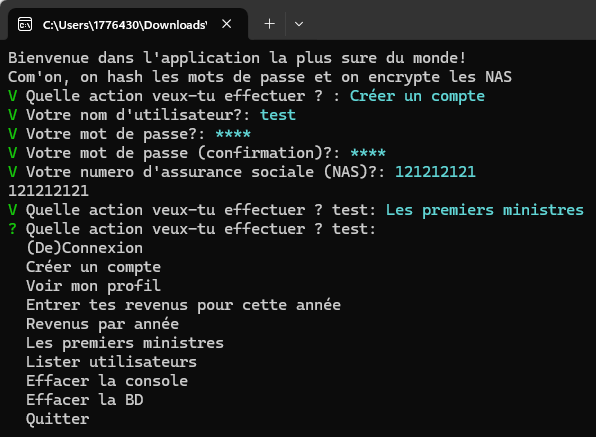  
2. Choisir l'option connexion et entrer la requête suivante: "'; DROP TABLE IF EXISTS MUtilisateur;    --" avec un mot de passe quelconque. La fonction de l'application ne fonctionnera pas mais la requête va supprimer la table MUtilisateurs puisque le commentaire "--" permet d'ignorer la fin de la première requête.  
   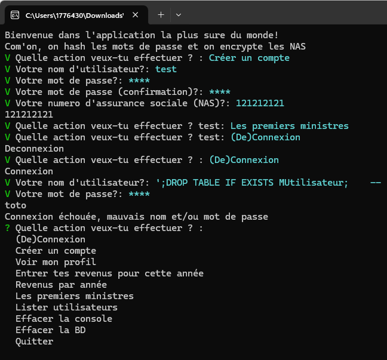  
3. Rafraichir la table MUtilisateur et constater que nous avons un message d'erreur puisqu'elle n'existe plus.  
   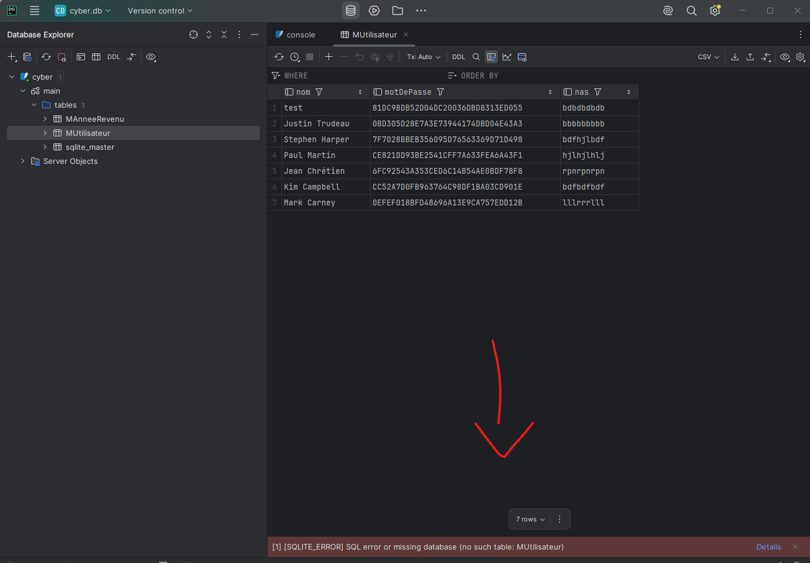  
4. Pour changer le mot de passe de Justin Trudeau, entrer la requête suivante dans l'application : "';  UPDATE MUtilisateur SET motDePasse = 'Passw0rd' WHERE nom = 'Justin Trudeau';  --"
   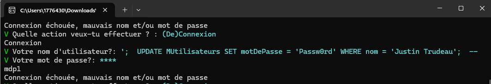  
5. Rafraichir la table MUtilisateur et constater que le mot de passe de Justin Trudeau a été changé.
   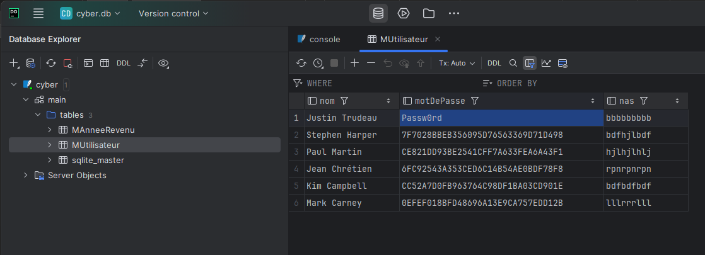  

### Correctif implanté

Description du correctif.

Preuve que l'attaque ne fonctionne plus avec étapes + copie d'écran
